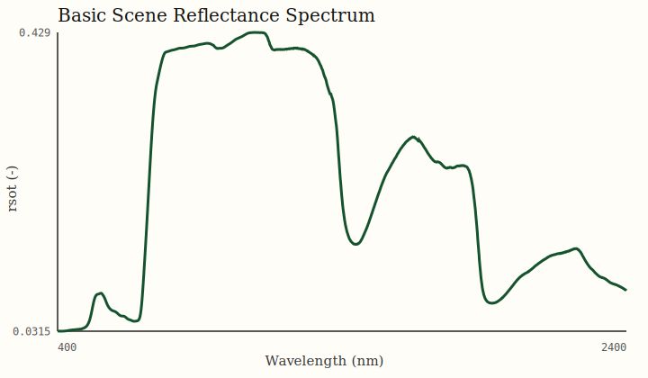
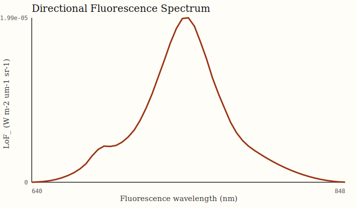
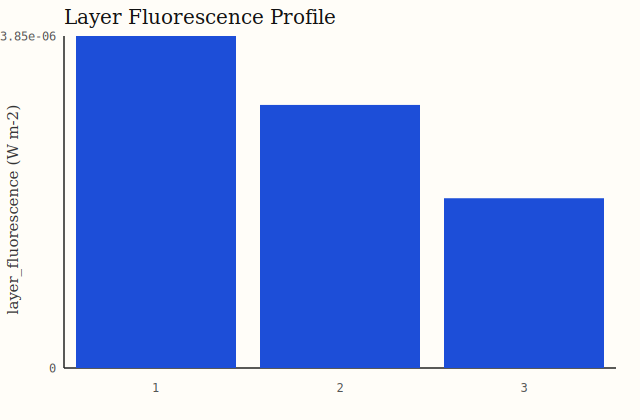

# Examples

The examples in `examples/` are intended to be runnable from a fresh source checkout after installation.

They are also exercised by the automated test suite so the documented commands stay live.

## 1. Minimal Scene Reflectance

Script:

- `examples/basic_scene_reflectance.py`

Run:

```bash
PYTHONPATH=src python examples/basic_scene_reflectance.py \
  --output examples/output/basic_scene_reflectance.json
```

Saved output:

- `examples/output/basic_scene_reflectance.json`

What it demonstrates:

- asset-backed `ScopeGridRunner.from_scope_assets(...)`
- minimal runner-ready dataset
- reflectance-only workflow
- summary extraction from the assembled `xarray.Dataset`

Visual:



## 2. High-Level Workflow Dispatch

Script:

- `examples/scope_workflow_demo.py`

Run:

```bash
PYTHONPATH=src python examples/scope_workflow_demo.py \
  --output examples/output/scope_workflow_demo.json
```

Saved output:

- `examples/output/scope_workflow_demo.json`

What it demonstrates:

- `run_scope_dataset(...)`
- dataset-driven workflow intent through `scope_options`
- directional outputs
- vertical-profile outputs
- fluorescence outputs merged with base reflectance products

Visuals:





## 3. Input Preparation CLI

Command:

```bash
scope prepare --help
```

Equivalent source-tree command:

```bash
scope-prepare --help
python prepare_scope_input.py --help
```

This is the intended entry point for building runner-ready `xarray` datasets from weather, observation, and Sentinel-2 bio inputs.

## 4. Lightweight Inference API

For repeated tensor-only inference without the `xarray` runner surface:

```python
import torch
from scope import ScopeInferenceModel
from scope.canopy.foursail import campbell_lidf

lidf = campbell_lidf(57.0, dtype=torch.float32)
model = ScopeInferenceModel.from_scope_assets(
    lidf=lidf,
    scope_root_path="./upstream/SCOPE",
    dtype=torch.float32,
)

outputs = model.reflectance(
    leafbio=...,
    lai=...,
    tts=...,
    tto=...,
    psi=...,
    soil_refl=...,
    outputs=("rsot", "rso"),
)
```

This surface is intended for production services that want:

- pure tensor inputs
- no `xarray` orchestration overhead
- only the requested outputs

## 5. What to Copy Into Real Applications

For application code, the most stable pattern is:

1. Prepare a runner-ready `xarray.Dataset`
2. Validate it with `validate_scope_dataset(...)`
3. Keep the workflow intent in dataset attrs
4. Call `ScopeGridRunner.run_scope_dataset(...)`
5. Persist the result with `write_netcdf_dataset(...)`

Use the example scripts as working templates rather than writing directly against low-level kernels unless you need custom research behavior.

## 6. Shell Workflow

For an installed shell workflow rather than Python example code:

```bash
scope prepare --help
scope run --help
```

This is the shortest production-facing CLI path:

1. build a prepared `xarray` dataset as NetCDF
2. execute a named workflow from that dataset
3. write the simulated output NetCDF and optional summary JSON
