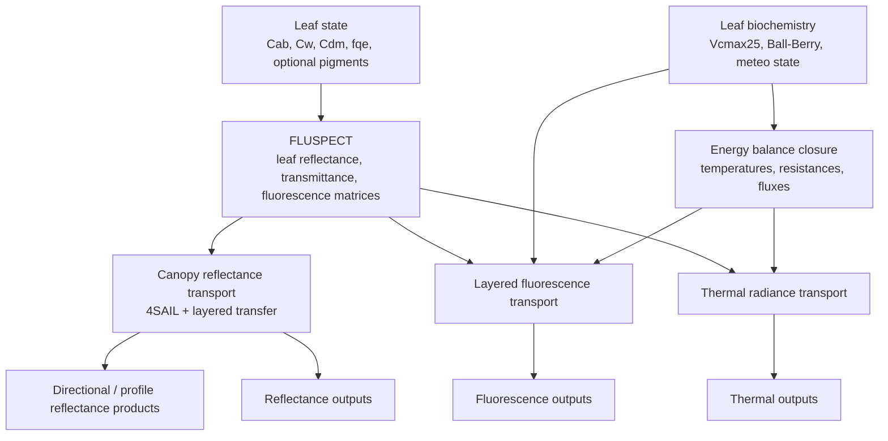

# Model Mechanics

This page explains how the current homogeneous-canopy `scope` stack is assembled.

## Physical Stack

At a high level, the model is organized as:

1. Leaf optics
2. Canopy radiative transfer
3. Fluorescence and thermal transport
4. Leaf biochemistry
5. Coupled energy balance

The current recommended user entry point is not the individual kernels but the runner layer, especially `ScopeGridRunner.run_scope_dataset(...)`.

## End-to-End Physics Flow

## ROI / Time Workflow

## Main Runtime Layers

### 1. Leaf optics

`FluspectModel` converts biochemical leaf parameters into:

- leaf reflectance
- leaf transmittance
- fluorescence source matrices

This is the lowest optical layer used by the canopy stack.

### 2. Canopy reflectance

`CanopyReflectanceModel` combines leaf optics, soil optics, canopy structure, and viewing geometry to produce:

- standard canopy reflectance terms
- directional reflectance products
- radiative profiles across layer interfaces

### 3. Fluorescence and thermal transport

`CanopyFluorescenceModel` and `CanopyThermalRadianceModel` reuse the canopy transport backbone to produce:

- canopy fluorescence radiance and flux products
- fluorescence directional / profile products
- thermal radiance and integrated thermal balance terms
- thermal directional / profile products

### 4. Biochemistry and energy balance

`LeafBiochemistryModel` provides assimilation, `Ci`, `rcw`, and fluorescence-yield drivers.

`CanopyEnergyBalanceModel` solves the coupled canopy state:

- sunlit / shaded leaf temperatures
- soil temperatures
- aerodynamic resistances
- sensible and latent heat fluxes
- coupled fluorescence and thermal outputs

## Same-State vs Phase-Lagged Diagnostics

For parity interpretation:

- use `leaf_iteration.*` metrics for true same-state leaf-physiology parity
- do not interpret raw `energy_balance.sunlit_*` and `energy_balance.shaded_*` diagnostics as the primary leaf-kernel parity signal

See [Benchmark Policy](benchmark-policy.md) for the exact reporting policy.
